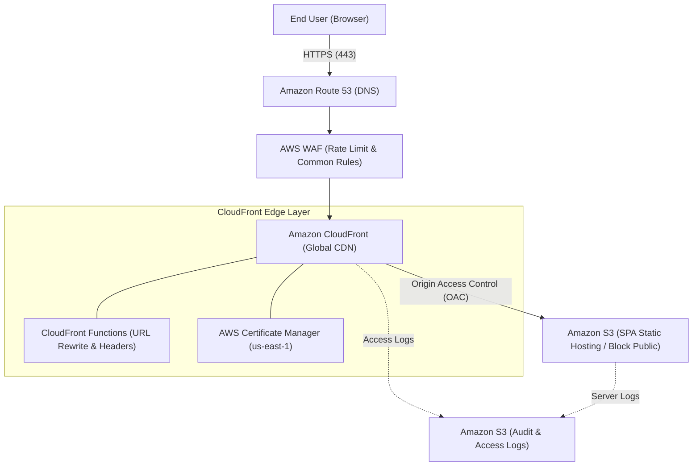

# CloudEdge-SPA-DualIaC 🚀

> **CloudFront + S3 による堅牢なSPA静的配信基盤を、Terraform × AWS CDK の二刀流で完全再現**

現代のフロントエンド（React / Vue / Next.js 静的エクスポート等）に求められる「高パフォーマンス」「強固なセキュリティ」「SPAルーティングの完全解決」を兼ね備えたベストプラクティス構成です。
宣言的アプローチ（Terraform / HCL）と手続き的オブジェクト指向アプローチ（AWS CDK / TypeScript）の双方を完全並行実装し、チームの開発言語スタックや運用ポリシーに応じて自由自在にインフラを選択・展開できます。

---

## 🌟 インフラのコアハイライト

1. **ゼロ・パブリックアクセス (OAC)**: S3バケットはパブリックアクセスを完全遮断。CloudFront Origin Access Control (OAC) 経由の署名付きHTTPSリクエストのみを許可。
2. **エッジ・ルーティング & セキュリティ**: CloudFront Functions による軽量URLリライト（SPA直リンクの `/index.html` 解決）と、HSTS / CSP / X-Frame-Options などのセキュリティヘッダー自動付与。
3. **多層防御 (AWS WAF)**: AWSManagedRulesCommonRuleSet による一般的脅威対策およびレートリミット制御。
4. **完全二刀流 (Dual-IaC)**: 同一の命名規則・セキュリティポリシー・ディレクトリ構造を Terraform と AWS CDK の双方で忠実に実装。

---

## 📐 システムアーキテクチャ



---

## 📂 ディレクトリ構成

```text
.
├── terraform/                   # Terraform (HCL) 実装
│   ├── environments/
│   │   ├── dev/
│   │   └── prod/
│   │       ├── main.tf
│   │       ├── variables.tf
│   │       ├── outputs.tf
│   │       └── terraform.tfvars
│   └── modules/
│       └── spa_hosting/         # S3, CloudFront, WAF, OACモジュール
├── cdk/                         # AWS CDK (TypeScript) 実装
│   ├── bin/
│   │   └── app.ts
│   ├── lib/
│   │   ├── spa-hosting-stack.ts # L3 Construct によるインフラ定義
│   │   └── parameters.ts
│   ├── cdk.json
│   ├── package.json
│   └── tsconfig.json
└── src/                         # SPA配信用静的アセット（index.html, assets/）
```

---

## 🚀 デプロイ手順

どちらかお好みのツールを選択してデプロイできます。

### Option A: Terraform で展開する場合

```bash
cd terraform/environments/prod

# 初期化
terraform init

# 実行計画の確認
terraform plan

# インフラの適用
terraform apply
```

### Option B: AWS CDK で展開する場合

```bash
cd cdk

# 依存パッケージのインストール
npm install

# 初回ブートストラップ（未実施の場合）
npx cdk bootstrap

# 差分確認とデプロイ
npx cdk diff
npx cdk deploy
```

---

## 👥 キャスト & エンドロール

AIアプリ工場劇場のプロフェッショナルたちによる共創プロジェクト：

- agent🔵 **アーキテクト / 要件定義**: SPA静的ホスティング基盤の選定および二刀流要件定義
- agent🍇 **リードエンジニア / 設計**: Terraform & CDKの設計整合性とモジュール分割戦略の策定
- agent🍊 **コードクラフトマン / 実装**: 妥協なきIaCコードとCloudFront Functionsの爆速実装
- agent🟢 **QAエンジニア / 品質保証**: パブリック遮断・ルーティング・セキュリティヘッダーの厳格な検証
- agent🟡 **プロデューサー / 総括**: プロジェクト統括およびリポジトリプロデュース
